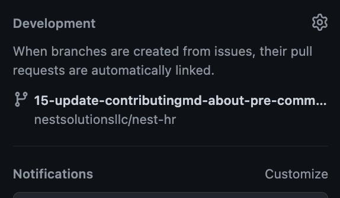
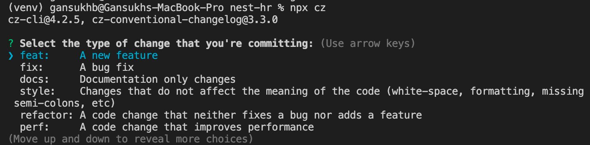

[](http://commitizen.github.io/cz-cli/)

# Contributing guidance

## Branch naming convention

Branches must not be created from locally. The `pre-commit` hook won't allow to commit in branches created locally.

To create new branch, click on "Create branch" link in issue's "Development" part.

Newly created branch will be looked like following image:



You can checkout new branch and start coding.

## Conventional commits

Begin your commits with at least one of these tags: `fix`, `feat`. And if you introduce a breaking change, then, you must add to your commit body the following `BREAKING CHANGE`. Using these 3 keywords will allow the proper identification of the semantic version. Of course, there are other keywords, but I'll leave it to the reader to explore them.

### Writing commits

Now to the important part, when writing commits, it's important to think about:

- Your future self
- Your colleagues
  You may think this is trivial, but it's not. It's important for the reader to understand what happened.

### Recommendations

- Keep the message short: Makes the list of commits more readable (~50 chars).
- Talk imperative: Follow this rule: `If applied, this commit will <commit message>`
- Think about the CHANGELOG: Your commits will probably end up in the changelog so try writing for it, but also keep in mind that you can skip sending commits to the CHANGELOG by using different keywords (like build).
- Use a commit per new feature: if you introduce multiple things related to the same commit, squash them. This is useful for auto-generating CHANGELOG.

| Do's                                            | Don'ts                          |
| ----------------------------------------------- | ------------------------------- |
| fix(commands): bump error when no user provided | fix: stuff                      |
| feat: add new commit command                    | feat: commit command introduced |

## Commitizen

To commit:

```
$ npx cz
```

command would be helpful to create commit messages with CLI dialogue.


